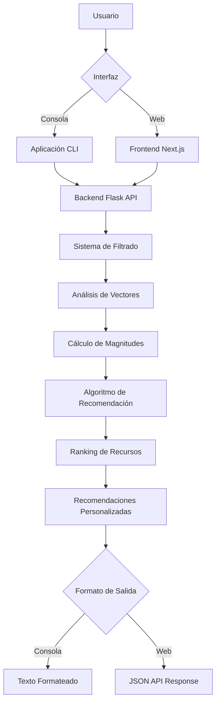

# 🎓 Sistema de Recomendación de Recursos Académicos

[](https://python.org)
[](LICENSE)
[](https://github.com)

> **Un sistema inteligente de recomendación que utiliza Álgebra Lineal y Optimización para sugerir recursos de estudio personalizados basados en el perfil académico del estudiante.**

## 📋 Descripción

Este proyecto implementa un **sistema de recomendación académico** que utiliza conceptos de **Álgebra Lineal** y **Optimización** para analizar el rendimiento histórico de estudiantes y recomendar los mejores recursos de estudio. El sistema considera la carrera, semestre y curso específico del estudiante para generar recomendaciones altamente personalizadas.

### ✨ Características Principales

- 🎯 **Recomendaciones Personalizadas**: Basadas en carrera, semestre y curso específico
- 📊 **Análisis de Competencia**: Utiliza vectores y magnitudes para evaluar el rendimiento estudiantil
- 🔬 **Algoritmo de Optimización**: Combina competencia del recomendador y popularidad del recurso
- 📚 **Base de Datos Rica**: Incluye diversos tipos de recursos (videos, libros, ejercicios, etc.)
- 🌐 **API REST Completa**: Endpoints para integración con aplicaciones web y móviles
- 🎨 **Interfaz Web Moderna**: Frontend desarrollado con Next.js y TypeScript
- 🐳 **Containerización**: Despliegue simplificado con Docker y Docker Compose
- 🚀 **Múltiples Interfaces**: Aplicación de consola y aplicación web

## 🏗️ Arquitectura del Sistema



## 🚀 Instalación y Configuración

### Prerrequisitos

- Python 3.8 o superior
- pip (gestor de paquetes de Python)
- Node.js 18+ (para el frontend)
- Docker y Docker Compose (opcional, para despliegue containerizado)

### Pasos de Instalación

1. **Clonar el repositorio**

   ```bash
   git clone https://github.com/SamSof28/recommender_system.git
   cd recommender_system
   ```

2. **Crear entorno virtual**

   ```bash
   python -m venv venv
   ```

3. **Activar entorno virtual**

   **Windows:**

   ```bash
   venv\Scripts\activate
   ```

   **macOS/Linux:**

   ```bash
   source venv/bin/activate
   ```

4. **Instalar dependencias del backend**

   ```bash
   pip install -r requirements.txt
   ```

5. **Instalar dependencias del frontend**
   ```bash
   cd recommender_frontend
   npm install
   # o si usas pnpm
   pnpm install
   ```

### 🐳 Instalación con Docker (Recomendado)

Para un despliegue rápido y consistente:

```bash
# Clonar el repositorio
git clone https://github.com/SamSof28/recommender_system.git
cd recommender_system

# Ejecutar con Docker Compose
docker-compose up --build
```

Esto iniciará automáticamente:

- Backend Flask API en puerto 5000
- Frontend Next.js en puerto 3000

## 🎮 Uso del Sistema

### 🖥️ Aplicación de Consola

```bash
# Desde el directorio recommender_backend
python src/main.py
```

### 🌐 Aplicación Web

```bash
# Terminal 1: Iniciar backend
cd recommender_backend
python api/app.py

# Terminal 2: Iniciar frontend
cd recommender_frontend
npm run dev
# o
pnpm dev
```

Luego accede a `http://localhost:3000` en tu navegador.

### 🔌 API REST

El sistema expone los siguientes endpoints:

- `GET /api/careers` - Obtener todas las carreras disponibles
- `GET /api/semesters/<career>` - Obtener semestres de una carrera
- `GET /api/courses/<career>/<semester>` - Obtener cursos de una carrera y semestre
- `POST /api/recommendations` - Obtener recomendaciones (requiere JSON con career, semester, course)

#### Ejemplo de Uso de la API

```bash
# Obtener carreras disponibles
curl -X GET http://localhost:5000/api/careers

# Obtener semestres de una carrera
curl -X GET http://localhost:5000/api/semesters/Ingeniería%20de%20Sistemas

# Obtener cursos de una carrera y semestre
curl -X GET http://localhost:5000/api/courses/Ingeniería%20de%20Sistemas/2

# Obtener recomendaciones
curl -X POST http://localhost:5000/api/recommendations \
  -H "Content-Type: application/json" \
  -d '{
    "career": "Ingeniería de Sistemas",
    "semester": 2,
    "course": "Álgebra Lineal"
  }'
```

### Flujo de Interacción

1. **Ingreso de Datos**: El sistema solicita:

   - 🎓 **Carrera** (ej: "Ingeniería de Sistemas")
   - 📅 **Semestre** (ej: 1, 2, 3...)
   - 📚 **Curso** (seleccionado de una lista disponible)

2. **Procesamiento**: El sistema:

   - Filtra estudiantes de la misma carrera y semestre
   - Crea vectores de calificaciones
   - Calcula magnitudes (índice de competencia)
   - Ejecuta el algoritmo de recomendación

3. **Resultados**: Muestra recursos ordenados por relevancia con:
   - Tipo de recurso
   - Enlace de acceso
   - Score de relevancia

### Ejemplo de Salida

```
🎓 ¡Bienvenido al Sistema de Recomendación de Recursos de Estudio! 🎓

Ingresa tu carrera (Ej: Ingenieria de Sistemas): Ingeniería de Sistemas
Ingresa el semestre (Ej: 1, 2): 2
Cursos disponibles: Álgebra Lineal, Cálculo II, Física II
¿Para qué curso necesitas recomendaciones?: Álgebra Lineal

------------------- TUS RECOMENDACIONES -------------------
1. [Video] Álgebra Lineal para Ingenieros
   Enlace: https://ejemplo.com (Score de Relevancia: 8.45)
2. [Libro] Álgebra Lineal y sus Aplicaciones
   Enlace: https://ejemplo.com (Score de Relevancia: 7.82)
3. [Ejercicios] Problemas Resueltos de Álgebra Lineal
   Enlace: https://ejemplo.com (Score de Relevancia: 7.15)
```

## 🔬 Fundamentos Matemáticos

### Álgebra Lineal Aplicada

El sistema utiliza conceptos fundamentales de Álgebra Lineal:

- **Vectores de Calificaciones**: Cada estudiante se representa como un vector en el espacio de cursos
- **Magnitud de Vectores**: Se calcula la competencia estudiantil usando la norma del vector
- **Optimización Lineal**: El algoritmo combina competencia y popularidad con pesos optimizados

### Fórmula de Recomendación

```
Score = (w₁ × Competencia_Promedio) + (w₂ × Popularidad)
```

Donde:

- `w₁ = 0.8` (peso de competencia)
- `w₂ = 0.2` (peso de popularidad)

## 📁 Estructura del Proyecto

```
recommender-system-project/
├── 📁 recommender_backend/     # Backend Flask API
│   ├── 📁 api/
│   │   ├── app.py              # Aplicación Flask principal
│   │   └── config.py           # Configuración de la API
│   ├── 📁 src/
│   │   ├── 📁 core/
│   │   │   ├── algebra.py      # Operaciones de álgebra lineal
│   │   │   └── recommender.py  # Algoritmo de recomendación
│   │   └── main.py             # Aplicación CLI
│   ├── 📁 data/
│   │   ├── mock_data.py        # Datos de prueba
│   │   └── documents/          # Recursos académicos
│   ├── Dockerfile              # Configuración Docker
│   ├── docker-compose.yml      # Orquestación de contenedores
│   ├── Procfile               # Configuración para despliegue
│   └── requirements.txt        # Dependencias Python
├── 📁 recommender_frontend/    # Frontend Next.js
│   ├── 📁 src/
│   │   └── 📁 app/
│   │       ├── page.tsx        # Página principal
│   │       ├── layout.tsx      # Layout de la aplicación
│   │       └── globals.css     # Estilos globales
│   ├── package.json            # Dependencias Node.js
│   └── next.config.ts          # Configuración Next.js
└── README.md                   # Este archivo
```

## 🛠️ Tecnologías Utilizadas

### Backend

- **Python 3.8+**: Lenguaje principal
- **Flask**: Framework web para la API REST
- **Flask-CORS**: Manejo de CORS para integración frontend
- **NumPy**: Operaciones matemáticas y vectores
- **Pandas**: Manipulación de datos
- **Scikit-learn**: Algoritmos de machine learning
- **Gunicorn**: Servidor WSGI para producción

### Frontend

- **Next.js 15.5+**: Framework React para aplicaciones web
- **TypeScript**: Tipado estático para JavaScript
- **Tailwind CSS**: Framework de estilos utilitarios
- **React 19**: Biblioteca de interfaz de usuario

### DevOps y Despliegue

- **Docker**: Containerización de aplicaciones
- **Docker Compose**: Orquestación de contenedores
- **Heroku**: Plataforma de despliegue en la nube

## 🚀 Despliegue en Producción

### Heroku

El proyecto está configurado para despliegue en Heroku:

```bash
# Instalar Heroku CLI
# Crear aplicación
heroku create tu-app-recommender

# Configurar variables de entorno
heroku config:set FLASK_ENV=production

# Desplegar
git push heroku main
```

### Docker

Para despliegue en cualquier plataforma que soporte Docker:

```bash
# Construir imagen
docker build -t recommender-system .

# Ejecutar contenedor
docker run -p 5000:5000 recommender-system
```

## 📊 Datos y Recursos

El sistema incluye:

- **Datos Académicos**: Información de carreras, semestres y cursos
- **Recursos Educativos**: Videos, libros, ejercicios, tutoriales
- **Historial de Calificaciones**: Datos de estudiantes anteriores
- **Metadatos**: Tipos de recursos, enlaces, recomendadores

## 🎯 Casos de Uso

- **Estudiantes**: Encuentra recursos de estudio personalizados
- **Profesores**: Identifica materiales complementarios efectivos
- **Instituciones**: Optimiza la selección de recursos académicos
- **Investigadores**: Analiza patrones de aprendizaje estudiantil

## 🚧 Roadmap Futuro

- [x] ~~Interfaz web interactiva~~ ✅ **Completado**
- [x] ~~API REST completa~~ ✅ **Completado**
- [x] ~~Containerización con Docker~~ ✅ **Completado**
- [ ] Interfaz web completamente funcional con formularios
- [ ] Integración con APIs de contenido educativo
- [ ] Sistema de feedback y mejora continua
- [ ] Análisis predictivo de rendimiento
- [ ] Recomendaciones colaborativas entre estudiantes
- [ ] Dashboard de administración
- [ ] Sistema de autenticación de usuarios
- [ ] Base de datos persistente (PostgreSQL/MongoDB)

## 🤝 Contribuciones

¡Las contribuciones son bienvenidas! Por favor:

1. Fork el proyecto
2. Crea una rama para tu feature (`git checkout -b feature/AmazingFeature`)
3. Commit tus cambios (`git commit -m 'Add some AmazingFeature'`)
4. Push a la rama (`git push origin feature/AmazingFeature`)
5. Abre un Pull Request

## 📄 Licencia

Este proyecto está bajo la Licencia MIT. Ver el archivo `LICENSE` para más detalles.

## 👥 Autores

- **Samuel Romaña Acevedo** - _Desarrollo inicial_ - [Samuel Romaña](https://github.com/SamSof28/)

## 📞 Contacto

- **Email**: sromana146@soyudemedellin.edu.co
- **GitHub**: [@SamSof28](https://github.com/SamSof28/)
- **LinkedIn**: [Tu Perfil](https://linkedin.com/in/tu-perfil)

---

<div align="center">

**⭐ Si este proyecto te ha sido útil, ¡no olvides darle una estrella! ⭐**

</div>
