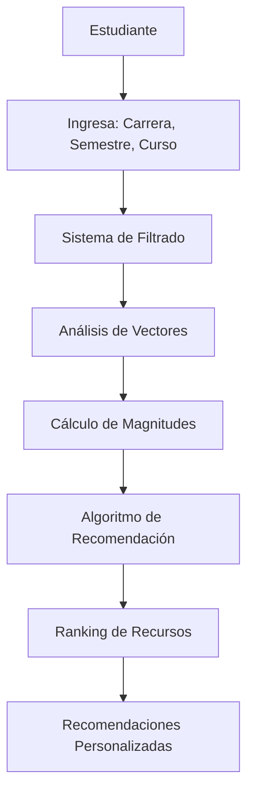

# 🎓 Sistema de Recomendación de Recursos Académicos

[](https://python.org)
[](LICENSE)
[](https://github.com)

> **Un sistema inteligente de recomendación que utiliza Álgebra Lineal y Optimización para sugerir recursos de estudio personalizados basados en el perfil académico del estudiante.**

## 📋 Descripción

Este proyecto implementa un **sistema de recomendación académico** que utiliza conceptos de **Álgebra Lineal** y **Optimización** para analizar el rendimiento histórico de estudiantes y recomendar los mejores recursos de estudio. El sistema considera la carrera, semestre y curso específico del estudiante para generar recomendaciones altamente personalizadas.

### ✨ Características Principales

- 🎯 **Recomendaciones Personalizadas**: Basadas en carrera, semestre y curso específico
- 📊 **Análisis de Competencia**: Utiliza vectores y magnitudes para evaluar el rendimiento estudiantil
- 🔬 **Algoritmo de Optimización**: Combina competencia del recomendador y popularidad del recurso
- 📚 **Base de Datos Rica**: Incluye diversos tipos de recursos (videos, libros, ejercicios, etc.)
- 🚀 **Interfaz Intuitiva**: Aplicación de consola fácil de usar

## 🏗️ Arquitectura del Sistema



## 🚀 Instalación y Configuración

### Prerrequisitos

- Python 3.8 o superior
- pip (gestor de paquetes de Python)

### Pasos de Instalación

1. **Clonar el repositorio**

   ```bash
   git clone https://github.com/SamSof28/recommender_system.git
   cd recommender_system
   ```

2. **Crear entorno virtual**

   ```bash
   python -m venv venv
   ```

3. **Activar entorno virtual**

   **Windows:**

   ```bash
   venv\Scripts\activate
   ```

   **macOS/Linux:**

   ```bash
   source venv/bin/activate
   ```

4. **Instalar dependencias**
   ```bash
   pip install -r requirements.txt
   ```

## 🎮 Uso del Sistema

### Ejecución Rápida

```bash
python src/main.py
```

### Flujo de Interacción

1. **Ingreso de Datos**: El sistema solicita:

   - 🎓 **Carrera** (ej: "Ingeniería de Sistemas")
   - 📅 **Semestre** (ej: 1, 2, 3...)
   - 📚 **Curso** (seleccionado de una lista disponible)

2. **Procesamiento**: El sistema:

   - Filtra estudiantes de la misma carrera y semestre
   - Crea vectores de calificaciones
   - Calcula magnitudes (índice de competencia)
   - Ejecuta el algoritmo de recomendación

3. **Resultados**: Muestra recursos ordenados por relevancia con:
   - Tipo de recurso
   - Enlace de acceso
   - Score de relevancia

### Ejemplo de Salida

```
🎓 ¡Bienvenido al Sistema de Recomendación de Recursos de Estudio! 🎓

Ingresa tu carrera (Ej: Ingenieria de Sistemas): Ingeniería de Sistemas
Ingresa el semestre (Ej: 1, 2): 2
Cursos disponibles: Álgebra Lineal, Cálculo II, Física II
¿Para qué curso necesitas recomendaciones?: Álgebra Lineal

------------------- TUS RECOMENDACIONES -------------------
1. [Video] Álgebra Lineal para Ingenieros
   Enlace: https://ejemplo.com (Score de Relevancia: 8.45)
2. [Libro] Álgebra Lineal y sus Aplicaciones
   Enlace: https://ejemplo.com (Score de Relevancia: 7.82)
3. [Ejercicios] Problemas Resueltos de Álgebra Lineal
   Enlace: https://ejemplo.com (Score de Relevancia: 7.15)
```

## 🔬 Fundamentos Matemáticos

### Álgebra Lineal Aplicada

El sistema utiliza conceptos fundamentales de Álgebra Lineal:

- **Vectores de Calificaciones**: Cada estudiante se representa como un vector en el espacio de cursos
- **Magnitud de Vectores**: Se calcula la competencia estudiantil usando la norma del vector
- **Optimización Lineal**: El algoritmo combina competencia y popularidad con pesos optimizados

### Fórmula de Recomendación

```
Score = (w₁ × Competencia_Promedio) + (w₂ × Popularidad)
```

Donde:

- `w₁ = 0.8` (peso de competencia)
- `w₂ = 0.2` (peso de popularidad)

## 📁 Estructura del Proyecto

```
recommender_system/
├── 📁 src/
│   ├── 📁 core/
│   │   ├── algebra.py          # Operaciones de álgebra lineal
│   │   └── recommender.py      # Algoritmo de recomendación
│   └── main.py                 # Aplicación principal
├── 📁 data/
│   └── mock_data.py           # Datos de prueba
├── 📁 venv/                   # Entorno virtual
├── requirements.txt           # Dependencias
└── README.md                  # Este archivo
```

## 🛠️ Tecnologías Utilizadas

- **Python 3.8+**: Lenguaje principal
- **NumPy**: Operaciones matemáticas y vectores
- **Pandas**: Manipulación de datos
- **Scikit-learn**: Algoritmos de machine learning
- **Matplotlib/Seaborn**: Visualización de datos

## 📊 Datos y Recursos

El sistema incluye:

- **Datos Académicos**: Información de carreras, semestres y cursos
- **Recursos Educativos**: Videos, libros, ejercicios, tutoriales
- **Historial de Calificaciones**: Datos de estudiantes anteriores
- **Metadatos**: Tipos de recursos, enlaces, recomendadores

## 🎯 Casos de Uso

- **Estudiantes**: Encuentra recursos de estudio personalizados
- **Profesores**: Identifica materiales complementarios efectivos
- **Instituciones**: Optimiza la selección de recursos académicos
- **Investigadores**: Analiza patrones de aprendizaje estudiantil

## 🚧 Roadmap Futuro

- [ ] Interfaz web interactiva
- [ ] Integración con APIs de contenido educativo
- [ ] Sistema de feedback y mejora continua
- [ ] Análisis predictivo de rendimiento
- [ ] Recomendaciones colaborativas entre estudiantes

## 🤝 Contribuciones

¡Las contribuciones son bienvenidas! Por favor:

1. Fork el proyecto
2. Crea una rama para tu feature (`git checkout -b feature/AmazingFeature`)
3. Commit tus cambios (`git commit -m 'Add some AmazingFeature'`)
4. Push a la rama (`git push origin feature/AmazingFeature`)
5. Abre un Pull Request

## 📄 Licencia

Este proyecto está bajo la Licencia MIT. Ver el archivo `LICENSE` para más detalles.

## 👥 Autores

- **Samuel Romaña Acevedo** - _Desarrollo inicial_ - [Samuel Romaña](https://github.com/SamSof28/)

## 📞 Contacto

- **Email**: sromana146@soyudemedellin.edu.co
- **GitHub**: [@SamSof28](https://github.com/SamSof28/)
- **LinkedIn**: [Tu Perfil](https://linkedin.com/in/tu-perfil)

---

<div align="center">

**⭐ Si este proyecto te ha sido útil, ¡no olvides darle una estrella! ⭐**

</div>
